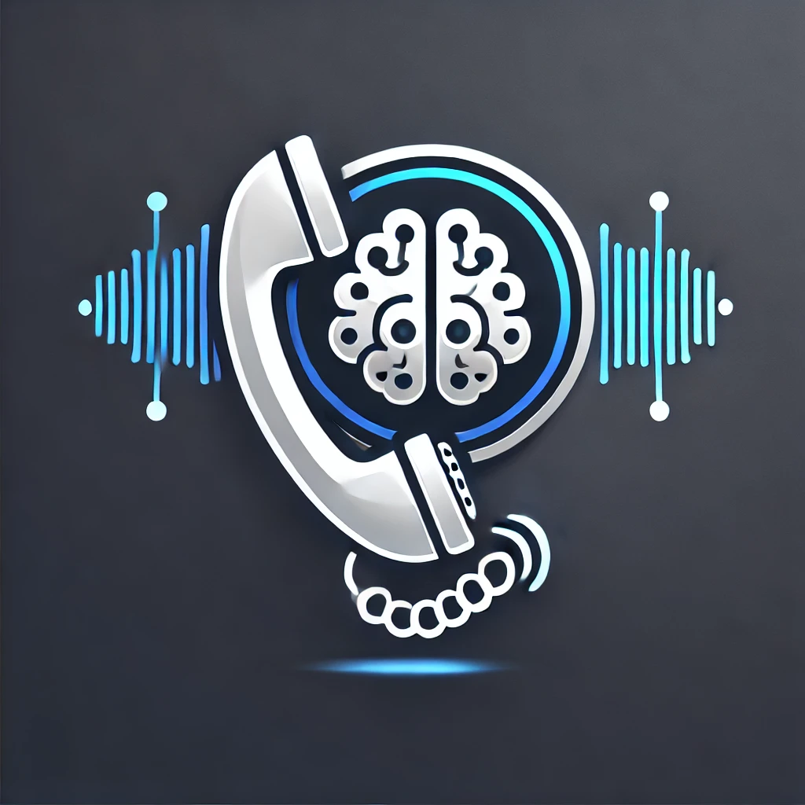
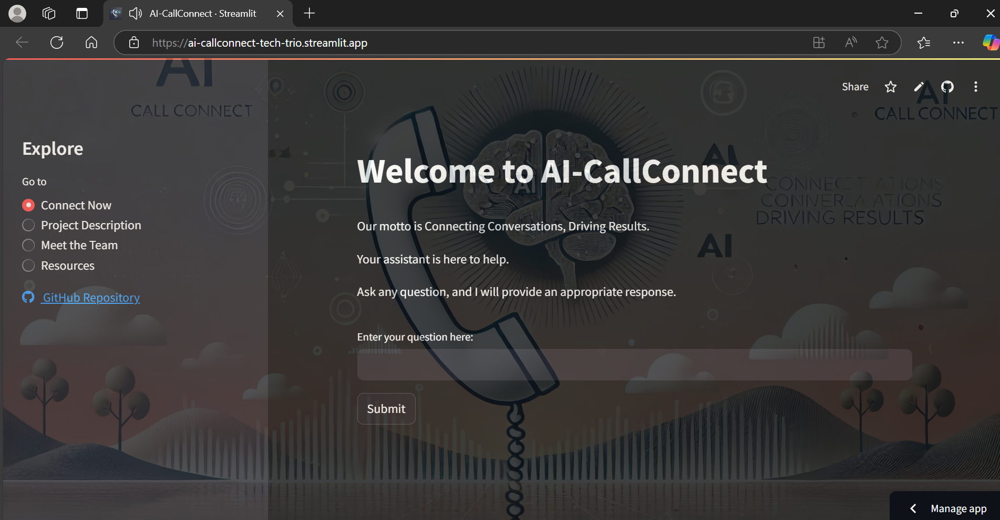
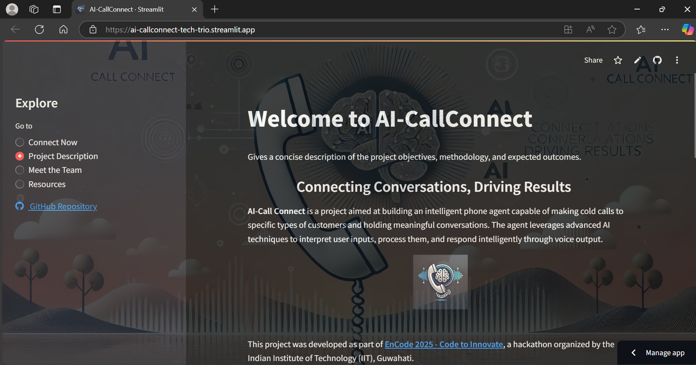
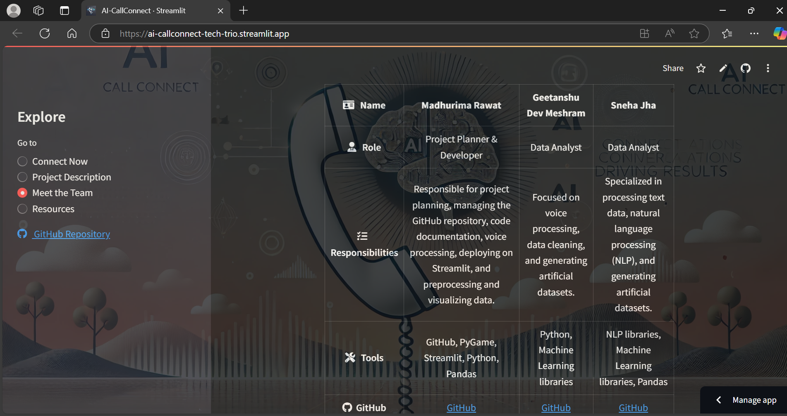
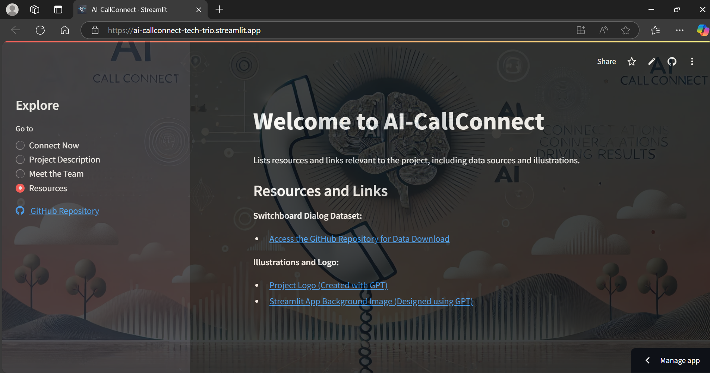
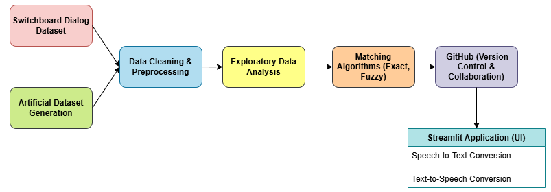

# AI-CallConnect
A cutting-edge AI-powered phone agent designed for seamless voice interactions, dynamic data handling, and scalable communication. Perfect for modern sales and customer engagement solutions.

<p align = center>  </p>
<p align = center> “Connecting Conversations, Driving Results”  </p>

You can access the deployed application at the following link: &nbsp;  [AI-CallConnect Streamlit App](https://ai-callconnect-tech-trio.streamlit.app/)

Here’s a preview of the app:

<a href="https://ai-callconnect-tech-trio.streamlit.app/"></a> <br>

<a href="https://ai-callconnect-tech-trio.streamlit.app/"></a> <br>

<a href="https://ai-callconnect-tech-trio.streamlit.app/"></a> <br>

<a href="https://ai-callconnect-tech-trio.streamlit.app/"></a>

The project was developed as part of <a href= "https://unstop.com/hackathons/encode-2025-code-to-innovate-udgam-2025-iit-guwahati-1289240">**EnCode 2025 - Code to Innovate**</a>, a hackathon organized by the Indian Institute of Technology (IIT), Guwahati.

### Table of Contents
- [Architecture Overview](#architecture-overview)
- [Setup and Installation](#setup-and-installation)
- [Usage](#usage)
- [Methodology](#methodology)
- [Tools and Libraries Used](#tools-and-libraries-used)
- [Contribution](#contribution)
- [License](#license)

## Architecture Overview

The architecture of AI-Call Connect is built to integrate multiple components for effective voice communication:

<p align = center></p>

### Key Components:
1. **Switchboard Dialog Dataset**: A conversational dataset used for dialogue preprocessing.
2. **Data Cleaning & Preprocessing**: Transforming the raw data into a format suitable for working of the streamlit app.
3. **Exploratory Data Analysis (EDA)**: Analyzing the dataset to understand patterns and insights for better modeling.
4. **Artificial Dataset Generation**: Augmenting the dataset to introduce additional data points for training.
5. **Matching Algorithms**: Implementing fuzzy and exact text matching techniques for accurate user query handling.
6. **Streamlit Application**: The frontend of the application, which includes speech-to-text and text-to-speech conversion for voice interaction.

## Directory Structure

```markdown
AI-CallConnect/
│
├── Codes/                        # Contains all project-related code
│   ├── streamlit_app.py           # Main Streamlit application for deployment
│   ├── streamlit_app_local.py     # Local version of Streamlit app (supports voice input/output)
│   ├── requirements_local.txt     # Local requirements for development
│   ├── requirements.txt           # Deployment requirements for Streamlit app
│   ├── data/                      # Contains all data-related folders
│   │   ├── raw/                   # Raw data files (e.g., original dataset)
│   │   ├── interim/               # Interim processed data
│   │   └── final/                 # Final cleaned and preprocessed data
│   └── images/                    # Contains images (e.g., app screenshots, logos)
│       ├── website_view_1.png     # Example image for app preview
│       ├── Illustration.webp      # Illustration image for the project
│       ├── Logo.webp              # Project logo image
│       ├── System_Architecture.png  # System architecture image
│       └── System_Architecture_Transparent.png  # Transparent version of the system architecture image
│
├── Resources/                    # Folder for additional resources and links
│   └── Dataset Link.txt           # Contains link to the dataset
│
├── Problem Statement/            # Folder for problem statement
│   ├── Encode_PS_2025.pdf         # PDF document of the problem statement for the hackathon
│   └── Solution Analysis.md       # Markdown file containing the solution analysis
│
└── README.md                     # Project documentation (you can update this with setup instructions, etc.)
```

### Directories:
- **Codes/**: Contains all project code, including Streamlit app files (`streamlit_app.py`, `streamlit_app_local.py`), data, images, and requirements.
- **data/**: Includes folders for raw, interim, and final datasets used in the project.
- **images/**: Stores images related to the project, such as app previews, logos, and system architecture diagrams.
- **Resources/**: Contains additional resources like links to datasets or references used in the project.
- **Problem Statement/**: Holds the problem statement document and solution analysis related to the hackathon.

### Files:
- **streamlit_app.py**: Main Streamlit application file for deployment.
- **streamlit_app_local.py**: Local version of the Streamlit app (supports voice input/output).
- **requirements_local.txt**: Lists the dependencies required for local development.
- **requirements.txt**: Lists the dependencies required for deploying the app on Streamlit server.
- **Dataset Link.txt**: Contains the link to the dataset used in the project.
- **Encode_PS_2025.pdf**: PDF document of the problem statement for the hackathon.
- **Solution Analysis.md**: Markdown file providing the solution analysis for the hackathon.
- **Illustration.webp**: Illustration image for the project.
- **Logo.webp**: Project logo image.
- **System_Architecture.png**: System architecture diagram image.
- **System_Architecture_Transparent.png**: Transparent version of the system architecture diagram.

## Setup and Installation

To set up the AI-Call Connect project on your local machine, follow these steps:

### Prerequisites:
- Python 3.7+
- Git
- pip (Python's package installer)

### Step 1: Clone the Repository
Start by cloning the repository to your local machine:

```bash
git clone https://github.com/yourusername/AI-CallConnect.git
cd AI-CallConnect
```

### Step 2: Install Dependencies
For local development, install the required Python libraries by running:

```bash
pip install -r requirements_local.txt
```

For deployment on the server, use the following `requirements.txt` file:

```bash
pip install -r requirements.txt
```

This will install all the necessary dependencies like `Streamlit`, `NLTK`, `Pandas`, and other libraries needed for the project.

### Step 3: Data and Code are Already in the Repository
All the datasets and code are already included in this repository. You don't need to manually download the dataset. Just make sure to have the repository cloned and proceed with the setup.

### Step 4: Run the Application Locally
To start the application locally, run:

```bash
streamlit run Codes/streamlit_app_local.py
```

This will launch the application on your local machine. The application will be available at [http://localhost:8501](http://localhost:8501).

This will deploy the application on the server. By default, it will be available at [http://localhost:8501](http://localhost:8501), but this can be adjusted based on your server configuration.

Streamlit will automatically run on the next available port if you have multiple applications running. For example, the next available port might be [http://localhost:8502](http://localhost:8502), and so on.

### Streamlit Server

Streamlit is a Python framework that allows you to deploy machine learning models and Python projects with ease. It eliminates the need to worry about the frontend and makes deployment simple and user-friendly.

#### Installing Streamlit
To install Streamlit on your system, just run the following command:

```bash
pip install streamlit
```

### Running Project in Streamlit Server

Make sure all dependencies are installed before running the app.

1. For local development, you can run the Streamlit app with the following command:

```bash
streamlit run Codes/streamlit_app_local.py
```

2. Navigate to [http://localhost:8501](http://localhost:8501) in your browser to view the homepage of your app.

## Deploying using Streamlit

1. Visit the official website of Streamlit: [Streamlit](https://streamlit.io/) <br>
2. Create an account with GitHub. <br>
3. Push all your code to a GitHub repository. <br>
4. Go to Streamlit and create a new deployment. <br>
5. Enter your GitHub repository name and specify the file name. If your file is named `streamlit_app.py`, it will be accessed directly; otherwise, specify the path. <br>
6. Ensure you upload all libraries and the `requirements.txt` file. <br>
7. You can specify the Python version in `requirements.txt` like so: `python==3.9`. <br>
8. Streamlit will install all dependencies from the `requirements.txt` file. <br>
9. Once everything is set up, your app will be deployed on the web, and you can share the link to access it from any browser.

## Usage

Once the application is running, you can interact with the AI agent using the voice interface:

1. **Speech-to-Text**: Speak into your microphone, and the system will convert your speech into text.
2. **Text-to-Speech**: The AI agent will respond to your queries in voice form.

The agent processes the input through its matching algorithms, and the response is generated based on the most relevant training data.

## Methodology

The development process of AI-Call Connect followed several steps to ensure the system's functionality and performance:

### 1. **Data Preprocessing**
   - **Dataset**: We used the **Switchboard Dialog Dataset** to train the AI agent. This dataset was cleaned and transformed into a question-answer format.
   - **Text Processing**: We utilized libraries like `NLTK` to preprocess and clean the dialogues, removing noise and irrelevant data.
   - **Artificial Dataset**: In addition to the Switchboard Dialog Dataset, we also generated an artificial dataset to further enhance the training process, ensuring a more diverse and robust dataset for the AI agent.

### 2. **Matching Algorithms**
   - We implemented **fuzzy matching** and **exact matching** techniques to process user inputs and find the best responses from the dataset.
   - The **fuzzy matching** algorithm helps the system understand inputs with typos or slight variations, while **exact matching** ensures the most relevant response is chosen when the input is clear.

### 3. **Voice Integration**
   - The system integrates **speech-to-text** for interpreting user inputs and **text-to-speech** for generating human-like responses. This is powered by advanced APIs and models.

### 4. **Collaboration**
   - The project is managed on **GitHub**, allowing for version control and collaborative development.

### Important Information

While the application works perfectly with voice input and output on the **local version**, the **deployed version** on Streamlit (`https://ai-callconnect-tech-trio.streamlit.app/`) does not support voice input. This is due to Streamlit not supporting system-level dependencies like `pyaudio` or any other sound device dependencies on their servers.

In the deployed version:
- Only the first generation is displayed in voice form.
- The remaining interactions are shown as text (text input, text output).

This is why two separate files have been added:
- `streamlit_app_local.py` (for local development, with voice input and output support)
- `streamlit_app.py` (for deployment on the Streamlit server, which works without voice input)

Similarly, we have two separate requirements files:
- `requirements_local.txt` (for local dependencies including `pyaudio` for voice input/output)
- `requirements.txt` (for deployment on Streamlit server without system-level dependencies like `pyaudio`)

## Tools and Libraries Used

- **NLTK**: For text preprocessing and natural language processing tasks.
- **Pandas**: For handling and manipulating the dataset.
- **Fuzzywuzzy**: For fuzzy text matching.
- **Streamlit**: For building and deploying the web application interface.
- **SpeechRecognition**: For speech-to-text functionality.
- **pyttsx3**: For text-to-speech conversion.
- **gTTS**: For converting text to speech using Google Text-to-Speech.
- **Pygame**: For handling audio output and interaction within the application.

## Contribution

We welcome contributions to improve and expand this project. If you'd like to contribute:

1. Fork the repository.
2. Create a new branch (`git checkout -b feature-branch`).
3. Make your changes and commit (`git commit -am 'Add new feature'`).
4. Push to the branch (`git push origin feature-branch`).
5. Create a pull request.

### Resources and Links

**Switchboard Dialog Dataset:**
- [Access the GitHub Repository for Data Download](https://github.com/cgpotts/swda)

**Illustrations and Logo:**
- [Project Logo (Created with GPT)](https://chatgpt.com/)
- [Streamlit App Background Image (Designed using GPT)](https://chatgpt.com/)

## License

This project is licensed under the MIT License - see the [LICENSE](LICENSE) file for details.
